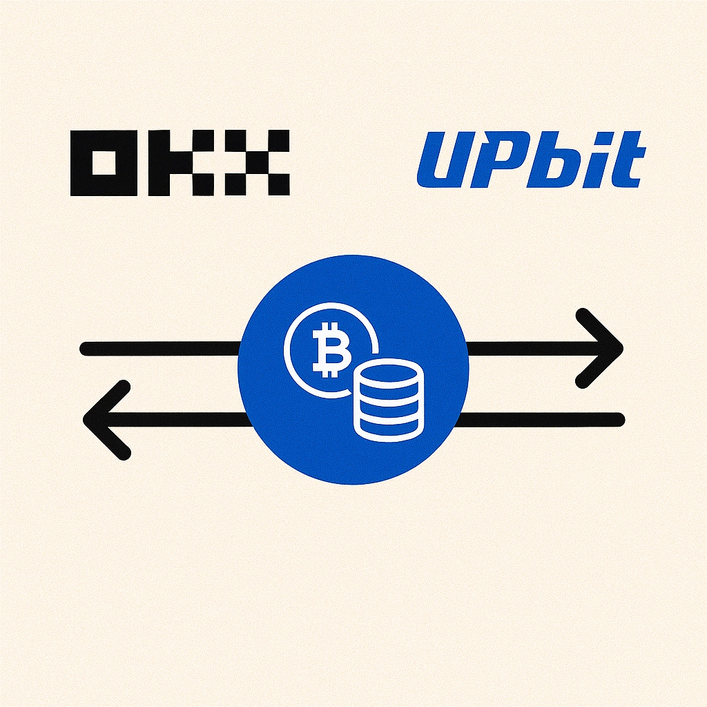
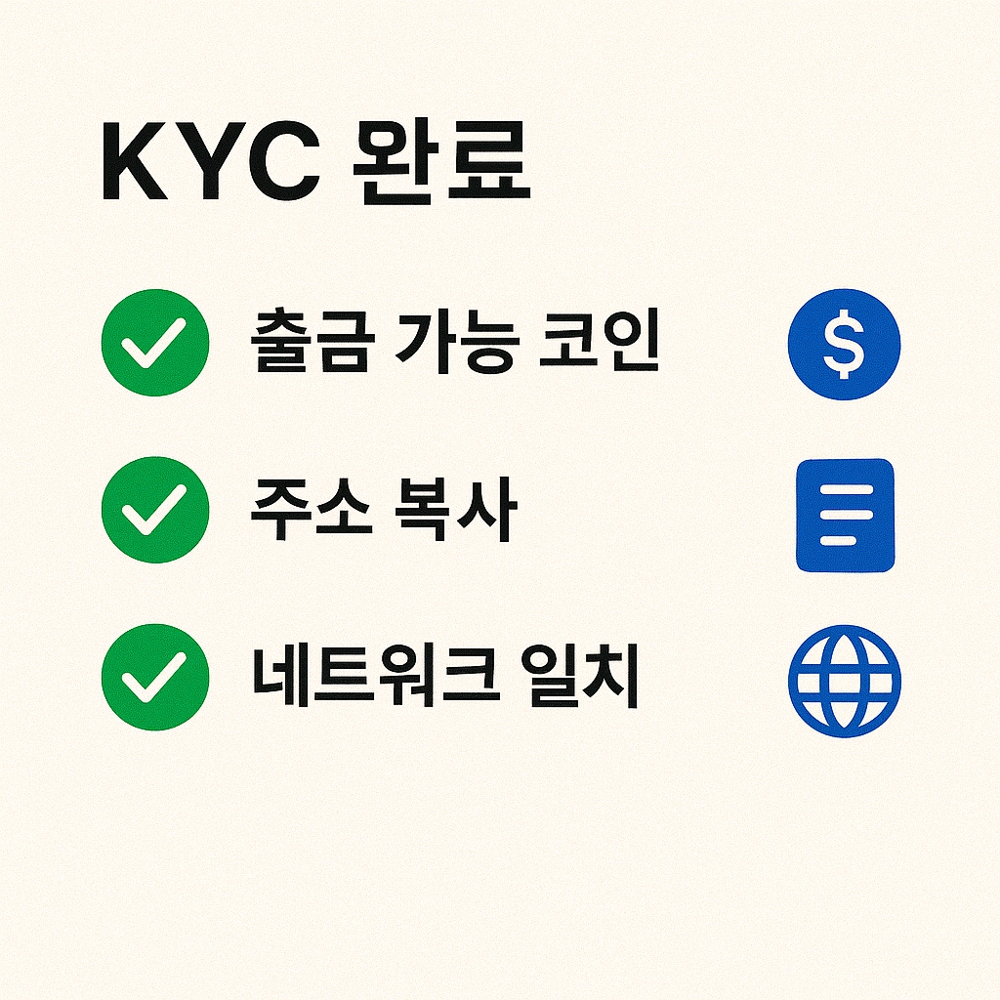
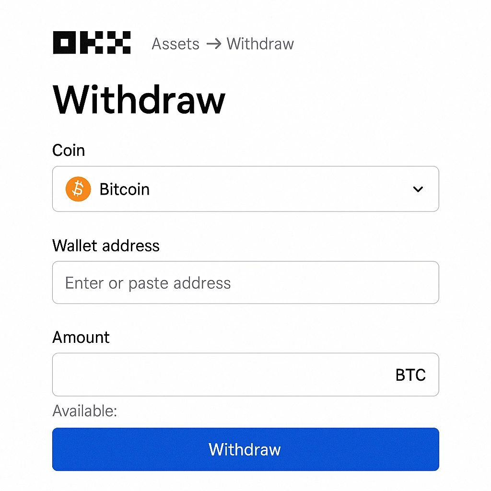
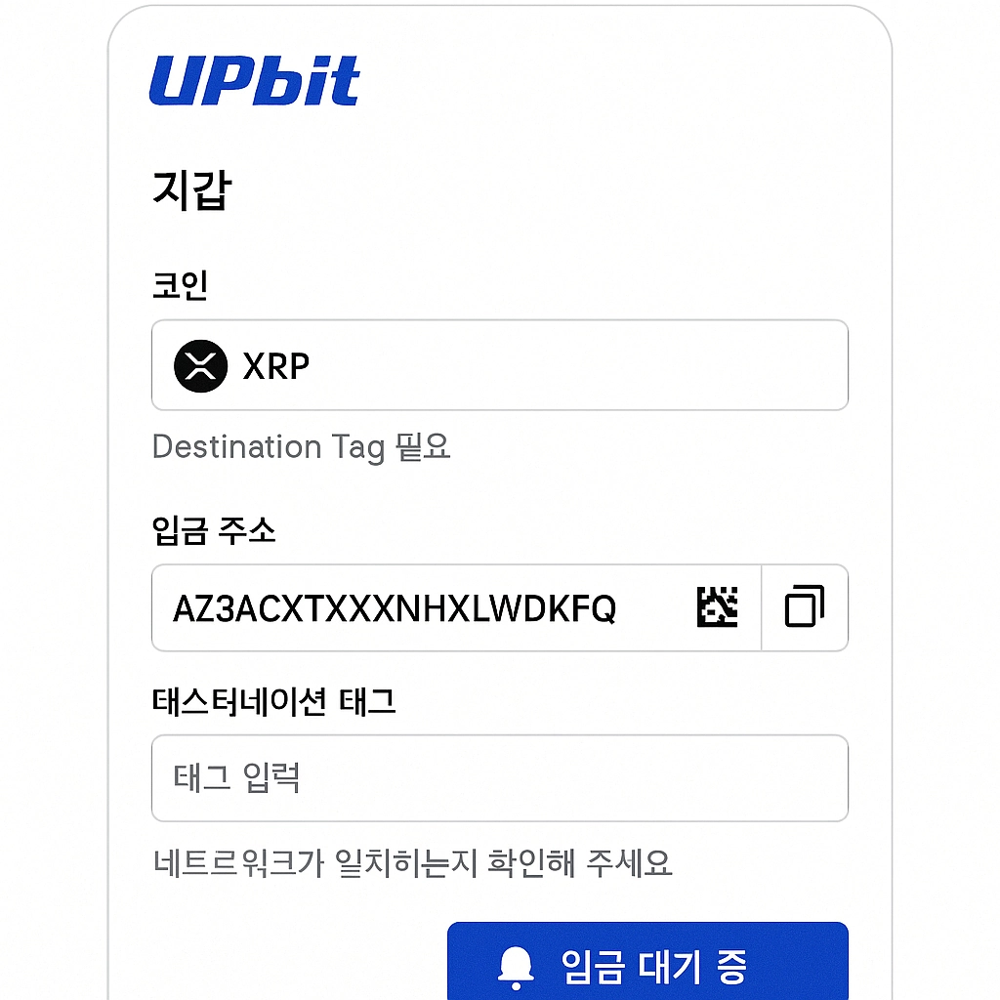
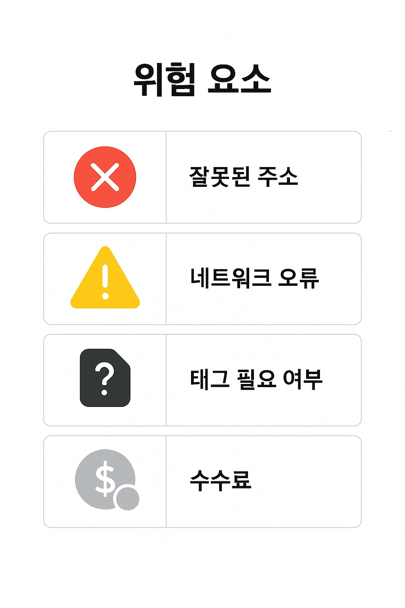

# How to Withdraw from OKX to Upbit

---

Moving crypto from an overseas exchange to turn it into Korean won—sounds tricky? Actually, once you nail the process of transferring coins from OKX to Upbit, it's pretty straightforward. Sure, the first time might feel like assembling IKEA furniture without the instructions, but after one successful run, you'll be doing it in your sleep.

The real gotchas? Network selection, address input, and that mysterious Tag/Memo field. Mess those up and you might be waving goodbye to your hard-earned crypto. But don't worry—this guide walks you through every step, from pre-withdrawal prep to seeing those coins safely land in your Upbit account, so even complete beginners can follow along with confidence.

---

## OKX to Upbit Withdrawal Overview

Transferring cryptocurrency from OKX exchange to your Upbit account might seem daunting at first glance, but it's actually simpler than you think—as long as you follow each step carefully. The process flows like this:

First, you'll verify which coins and networks are supported for withdrawal. Then you'll initiate the withdrawal on OKX, carefully entering the destination address and any required Tag/Memo information. After that, it's a waiting game while Upbit receives the deposit. Finally, you'll confirm everything arrived safely.

Think of it like mailing a package: you need the right address, the correct postal service (network), and sometimes a special apartment number (Tag/Memo). Skip any of these details and your package might end up in crypto limbo.

This guide breaks down each stage with expert-level clarity while keeping things accessible for beginners, highlighting the key risks and precautions along the way.

## Pre-Withdrawal Preparation

**Complete KYC verification**: Both OKX and Upbit may require identity verification, especially for larger withdrawal amounts. Get this sorted first to avoid last-minute headaches.

**Confirm the coin is supported**: Not all coins play nice with every exchange. Double-check that Upbit actually supports the crypto you want to send. Popular choices like Ripple (XRP) and Tron (TRX) usually work smoothly.

**Pay attention to network selection**: This is where things get real. Networks like TRC20 and ERC20 need to match on both ends. Choose the wrong one and your crypto could vanish into the digital void—no joke.

**Prepare withdrawal address and Tag/Memo**: Some coins like Ripple require a Tag or Memo field. Forget to include it and your deposit might never arrive, or you'll be stuck dealing with customer support to recover it.

👉 [Ready to start trading smarter? Join OKX now and get the edge you need](https://www.okx.com/join/62834398)

## OKX Withdrawal Process

**Log into OKX and navigate to Assets**, then select the Withdraw option. The interface is pretty intuitive, but take your time to avoid clicking the wrong buttons.

**Search for the coin you want to withdraw**—let's say XRP or TRX. Make sure you're selecting the exact coin, as some have similar names.

**Copy your Upbit deposit address**: Head over to Upbit, find the deposit screen for your chosen coin, and carefully copy both the address and any Tag/Memo information. Use copy-paste, never type manually. Seriously, never.

**Enter the network, address, and Tag in OKX**: Paste your copied information, select the correct network, set your withdrawal amount, and review everything twice. Then review it again.

**Complete security verification**: You'll likely need to verify through 2FA or email confirmation. Once that's done, hit that withdrawal button and cross your fingers (though if you followed the steps correctly, you won't need luck).

## Receiving on Upbit

Check if your withdrawn coins show up as "pending deposit" on Upbit. The status screen will keep you updated, though watching it won't make things go faster.

**Verify the amount and coin type match** what you sent. If something looks off, double-check your withdrawal details on OKX.

**For coins requiring Tag/Memo**, confirm that Upbit received this information correctly. Missing tags are the number one reason for delayed deposits.

**Wait for blockchain confirmation**: Depending on the coin and network, this could take anywhere from a few minutes to half an hour. Ripple and Tron are usually faster, while Ethereum-based transfers might take longer when the network is congested. Grab a coffee—crypto moves on its own schedule.

## Precautions and Mistake Prevention Tips

**Always copy-paste addresses**—manual typing is asking for trouble. One wrong character and your crypto takes a permanent vacation.

**Check network fees and Upbit's minimum deposit requirements**. If you're moving tiny amounts, transaction fees might eat up more value than you're actually transferring. Do the math first.

**Don't skip the Tag/Memo field** for coins like Ripple. This isn't optional metadata—it's essential routing information. Missing it is like sending mail without an apartment number in a massive building.

**Consider security and reporting requirements for large withdrawals**. Both exchanges may flag or delay unusually large transfers for additional verification.

**Verify the coin is Upbit-compatible before sending**. Sending an unsupported coin is like trying to deposit euros at a bank that only accepts dollars—it's not going to work, and recovery might be impossible.

👉 [Want seamless crypto transfers? Get started with OKX using code 62834398](https://www.okx.com/join/62834398)

## ✅ FAQ

**Q1. How much are OKX withdrawal fees?**  
A. Fees vary by coin and network. Generally, XRP and TRX offer lower withdrawal costs compared to Ethereum-based tokens, making them more economical for transfers.

**Q2. How long does it take for coins to reach Upbit from OKX?**  
A. Transfer times depend on the coin and network conditions. Ripple and Tron typically take 10-20 minutes, though network congestion can cause delays. Think of it as blockchain rush hour—sometimes you just have to wait.

**Q3. What happens if I enter the wrong Tag/Memo?**  
A. For coins like Ripple that require tags, an incorrect or missing Tag/Memo can result in delayed or failed deposits. You'll likely need to contact customer support to resolve the issue, which can take days. Prevention is definitely better than cure here.

**Q4. Can I withdraw small amounts?**  
A. Technically yes, but many coins have minimum withdrawal amounts, and fees might exceed your withdrawal value. Always calculate whether the transfer makes economic sense before proceeding.

---

Transferring crypto from OKX to Upbit doesn't have to be nerve-wracking once you understand the process. The key takeaways: verify everything twice, never skip the Tag/Memo for coins that need it, and choose the right network. Why is **OKX suitable for international-to-domestic crypto transfers**? It offers competitive fees, supports multiple networks, and maintains reliable withdrawal processing—making it an ideal bridge between global trading and local exchanges. Start your [seamless crypto journey here](https://www.okx.com/join/62834398).
